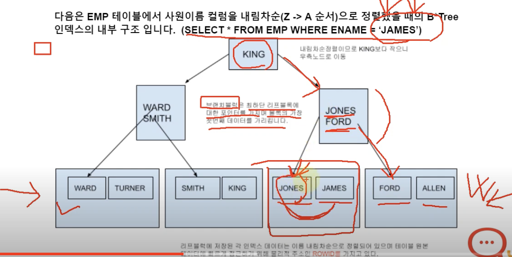
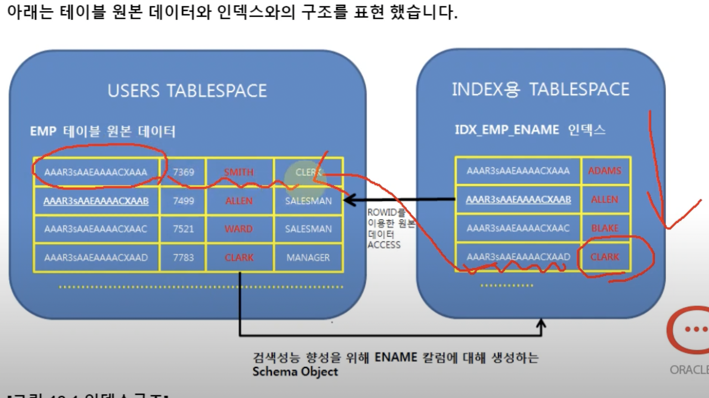

## 인덱스

- 테이블의 칼럼에 대해 생성되는 객체로 별도의 공간에 컬럼값들을 정렬한 후 생성
- 데이터를 빨리 찾기위해서 사용( ROWID(오라클에서 실제 레코드, 행이 있는 물리적 주소)를 찾은 후 실제 원본 데이터를 빠르게 접근)
- 테이블의 기본키를 생성하면 자동으로 고유 인덱스로 생성됨.
- 이름처럼 중복값이 있다면 ROWID 정렬
- 만약 값에 null이 존재한다면 오름차순 정렬시 맨 뒤에 위치하며 null값은 인덱스에 포함되지 않음.
    - 그래서 where COLNM IS NULL을 사용하면 COLNM 인덱스를 경유하지 않음.

### 인덱스 종류 (만드는형태에 따라)

- **단일인덱스**
    - 하나의 컬럼
- **복합인덱스**
    - 여러개의 컬럼
- **오름차순(내림차순) 인덱스**
- **함수기반 인덱스**
    - SQL함수나 표현식에 생성

### 인덱스 종류 (실제 인덱스가 내부적으로 어떻게 구성되어 지는지에 따라서)

- **B*Tree 인덱스**
    - 일반적인 오라클 인덱스인 균형잡힌 트리 형태
- **Bitmap인덱스**
    - 비트를 이용하여 컬럼 값을 간결하게 저장
    - or, not 함수 반응 좋음
- **Bitmap Join 인덱스**
    - 두 테이블 조인시 조인한 결과 칼럼에 대해 비트맵 인덱스를 생성
- **역전환키 인덱스**
    - 인덱스 컬럼의 값을 역으로 변경하여 B*Tree 인덱스를 구성

#### B*Tree 인덱스

- 오라클에서 만드는 인덱스는 비트리(B*Tree) 인덱스
    - Tree구조와 유사
    
    
    
- 여러개 컬럼으로 구성한다면 첫번째 열, 선행 컬럼은 가장 자주 액세스 되며 유일한 값을 가지는 컬럼을 사용하는 것이 좋음

**<💡> 입력 또는 수정이 빈번한 테이블에 많은 인덱스가 있는 경우 문제 생길 가능성 주의**

- OR처럼 범위를 넓히면서 검색하는 경우 제성능 어려움
- 특히 NOT을 사용하는 부정연산에 취약 (→ 비트맵인덱스에는 좋음)

**<💡>  where, 조인절에 빈번히 출현하는 컬럼에 인덱스 적용필요**

- 오라클이 판단하여 원본테이블 또는 index테이블에서 검색을 실시(대량이거나 인덱스가 존재한다면 대체로 index테이블 우선조회함)
    - 힌트로 어느 테이블에서 조회할지 설정 가능